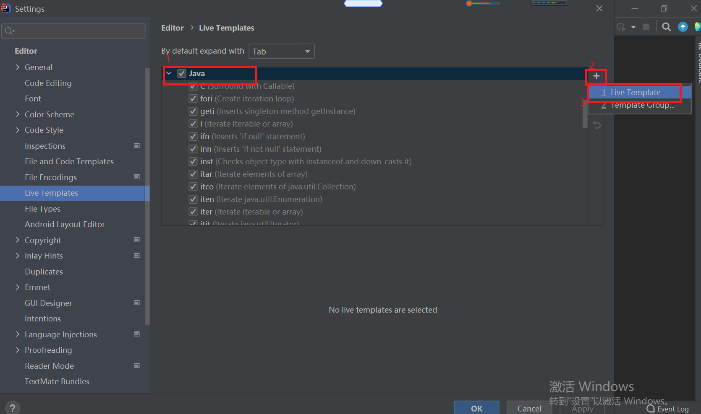
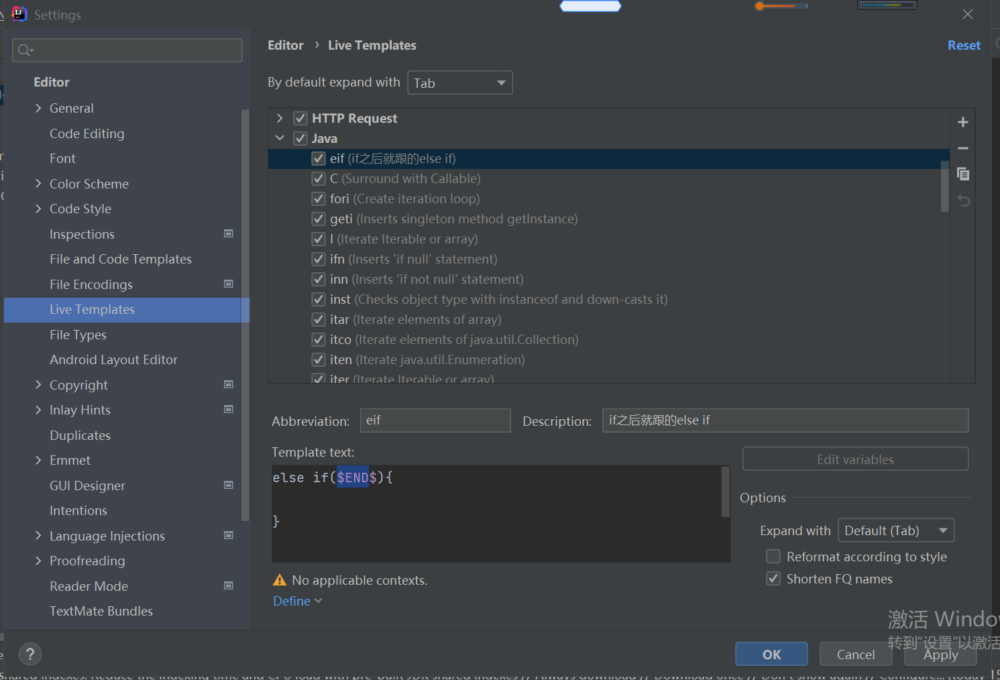
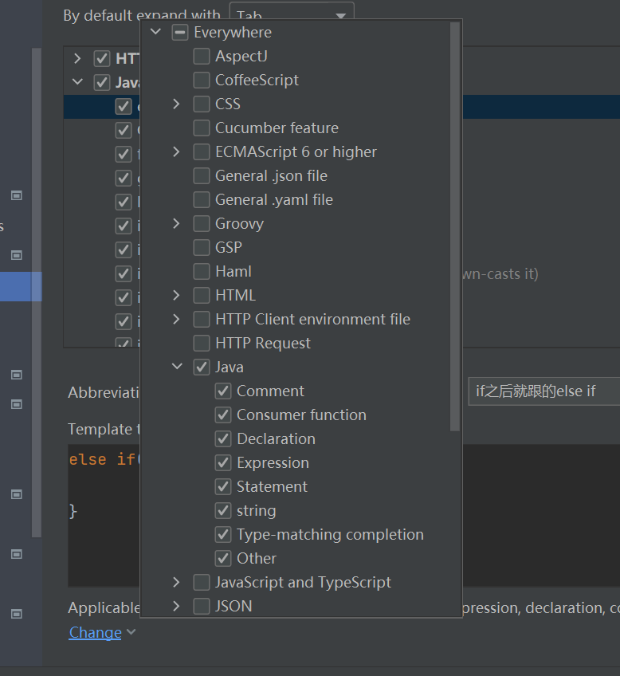
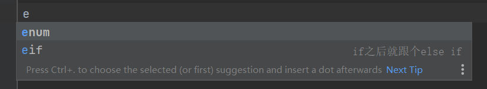
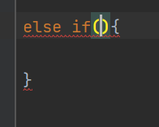

环境：ideaIU-2021.1.2 windows版

​        IntelliJ IDEA中的Live Tmplate（动态代码模板）功能是提高程序员工作效率的神器，大家可以把它理解为自定义代码提示。IntelliJ IDEA中已自带很多Live Tmplate，本文作者按需求自定义的Live Tmplate。请大家注意本文介绍的Live Tmplate敲出来后并不完整有些语法错误，请自己补全。

# 新建一个Live Tmplate
   点击菜单"File|Setting...”或快捷键"<kbd>Ctrl</kbd>+<kbd>Alt</kbd> +<kbd>S</kbd>”打开Settins对话框。


  在左栏选择“Editor|Live Tmplates”进入Live Tmplate界面

  选择图中`Java`’、`+`|`1Live Tmplate`



很多分支语句的形式是if之后就跟个else if



提示符：`eif`

模板代码：

```
else if($END$){ 

}
```
`$END$`表示代码生成后光标落在的位置

点击`Define`确定Tmplate的有效范围



# 测试

在打开的java文件编辑区中输入“eif”出现代码提示



选中eif并回车



# 配置文件

位置在

```
C:\Users\Administrator\AppData\Roaming\JetBrains\IntelliJIdea<版本>\template
```
可以备份此文件夹，也可以直接在文件里配置

打开文件夹下的`Java.xml`文件好看到

```xml
<?xml version="1.0"?>

-<templateSet group="Java">


-<template toShortenFQNames="true" toReformat="false" description="if之后就跟个else if" value="else if($END$){ }" name="eif">


-<context>

<option value="true" name="JAVA_CODE"/>

</context>

</template>

</templateSet>
```

其他模板不演示了，我会把`templates`与文章放在相同文件夹下