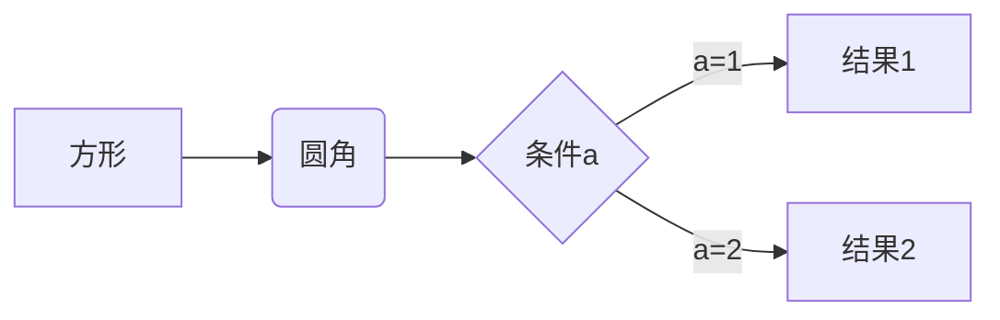
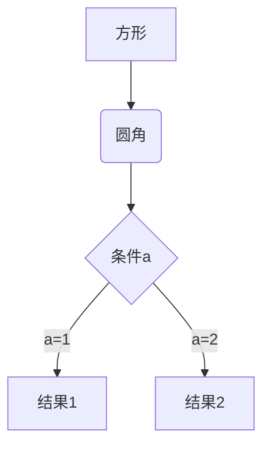

# 目录
把文档中所有标题渲染成目录

[toc]

# 字体
## 标题
### 下划线标题
一级标题
============
二级标题
---------------
### #号标题

`#` +空格+文字

# 标题1
## 标题2
### 标题3
#### 标题4
##### 标题5
###### 标题6

## 加重与斜体
*和_都是加重，效果一样

*斜体*

**粗体**

***斜体同时粗体***

_single underscores_

## 高亮
==高亮==是两个`=`围上，为非标准语法

## 删除线
~~删除线~~

## 上标与下标
^上标^是`^`围上

~下标~是`~`围上

# 脚注
鼠标放在下行“zhu"这看看效果

创建脚注格式类似这样 [^zhu]。

[^zhu]: 学的不仅是技术，更是梦想！！！

# 转义字符
为\，如：

即`\`加`#`

\# 不是标题

支持转义的标记：

\\   反斜线

\`   反引号

\*   星号

\_   底线

\{\}  花括号

\[\]  方括号

\(\)  括弧

\#   井字号

\+   加号

\-   减号

\.   英文句点

\!   感叹号

# 分割线
用三个以上的星号、减号、底线来建立一个分隔线
___

_ _ _

* * *

***

- - -

---------------------------------------

# 段落

### 空行

看上去空一行视为新一段，
如制表符、空格也视为看上去空一行

第二段

### 结尾两个空格

第一段   
第二段

# 区域引用

## 每行>

> This is a blockquote with two paragraphs. Lorem ipsum dolor sit amet,
> consectetuer adipiscing elit. Aliquam hendrerit mi posuere lectus.
> Vestibulum enim wisi, viverra nec, fringilla in, laoreet vitae, risus.
> 
> Donec sit amet nisl. Aliquam semper ipsum sit amet velit. Suspendisse
> id sem consectetuer libero luctus adipiscing.

## 每段>

> This is a blockquote with two paragraphs. Lorem ipsum dolor sit amet,
consectetuer adipiscing elit. Aliquam hendrerit mi posuere lectus.
Vestibulum enim wisi, viverra nec, fringilla in, laoreet vitae, risus.

> Donec sit amet nisl. Aliquam semper ipsum sit amet velit. Suspendisse
id sem consectetuer libero luctus adipiscing.

## 可嵌套

>一级
>> 二级
>>
>> >333
>
>这里上方必须空一行，才能退回一级区域引用

# 表格
列1|列2|列3
--|--|--
内容1|内容2|内容3

下例冒号在左为左对齐（默认），在右为右对齐，在俩侧为居中对齐

| 左对齐 | 右对齐 | 居中对齐 |
| :-----| ----: | :----: |
| 单元格 | 单元格 | 单元格 |
| 单元格 | 单元格 | 单元格 |
# 代码区块
## 缩进
这个每行一阶的缩进（4 个空格或是 1 个制表符）

    制表符缩进
    
        不能嵌套
不缩进即结束

## 代码
代码标识（`）不是单引号，而是'~'那个键位不按shift

比如html：`<h1>标题没效果</h1>`

Use the `printf()` function.

此例用代码块包裹一行的局部,但等价于用HTML的code标签包裹局部，同时用p标签包裹整行，与下面相同

<p>Use the <code>printf()</code> function.</p>

### 多行代码

三个代码标识标识（`或~，同一个键位）加语言类型，然后下一行写代码
```java
public class RunClass {
    public static void main(String[] args) {
        System.out.println("Hello World");
    }
}
```

在代码块里表示包括三个代码标识符`` `的MarkDown代码,最外层三个`~`
~~~
```java
public class RunClass {
    public static void main(String[] args) {
        System.out.println("Hello World");
    }
}
```
~~~
### 转义
如代码块内需要`` ` ``，则代码块开始/结束各用两个`` ` ``

\在这里无转义效果

``There is a literal backtick (`) here.``

开始/结束的两个`` ` ``不能和内部`` ` ``不能紧挨着，必须有其他字符或空格
# 列表
## 无序列表
使用星号、加号或是减号作为列表标记。
标记和文字之间需要1-4给空格，空格键和制表符键效果一样，格式如：标记 文字

* Red
	* Green
		* Blue
			* Black
+ Red 
+ Green
+ Blue
- Red
- Green

## 有序列表
有序列表与Html相同，用ol和li标签


# 链接
his is [an example](http://example.com/ "Title") inline link.


文字和链接地址一样时，直接写出来就行

<http://baidu.com>

<68312307@qq.com>

http://baidu.com

www.baidu.com

## 变量形式
This is [an example][id] reference-style link.

[id]: http://example.com/ "Optional Title Here"

文本和id名相同，如：[id]

文字提示可以换行缩减

打开[百度][bd]

[bd]:http://baidu.com
    "搜索引擎"
# 图片


图片id和链接一样支持变量方式

![替代文字][imgSrc]

[imgSrc]: https://www.baidu.com/img/PCtm_d9c8750bed0b3c7d089fa7d55720d6cf.png "Optional title"

## 图片对齐和尺寸

## 图片链接

[](http://www.baidu.com "百度" )

# 复选框

- [x] 已勾选
- [ ] 未勾选

# 图形
横向流程图和横向流程图差别只是graph后的类型标记不同，LR和TD

## 横向流程图(graph LR)

## 横向流程图(graph TD)

## 标准流程图
```flow
st=>start: 开始框
op=>operation: 处理框
cond=>condition: 判断框(是或否?)
sub1=>subroutine: 子流程
io=>inputoutput: 输入输出框
e=>end: 结束框
st->op->cond
cond(yes)->io->e
cond(no)->sub1(right)->op
```

```flow
st=>start: 开始框
op=>operation: 处理框
cond=>condition: 判断框(是或否?)
sub1=>subroutine: 子流程
io=>inputoutput: 输入输出框
e=>end: 结束框
st(right)->op(right)->cond
cond(yes)->io(bottom)->e
cond(no)->sub1(right)->op
```
格式：变量名=>标记: 文本

括号里表示right、bottom表示箭头方向，默认不加括号为bottom

condition括号内可以填写yes、no
# html
MarkDown兼容html

# 支持html

<h1>支持html</h1>

以下举几个比较特殊的用法

## 注释
markdown本身没注释，用html注释
<!--看不见这句话-->

## 锚定

[跳转](#target)

占行

占行

占行

占行

占行

占行

占行

占行

占行

占行

占行

占行

占行

占行

占行

占行

<span id="target">目标位置